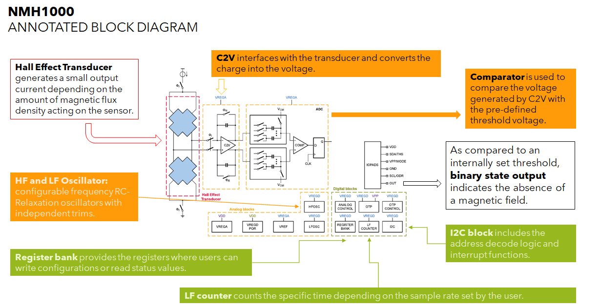

# NXP Application Code Hub

## Magnetic Wake-up Example using NMH1000 Magnetic Switch Sensor

- This example demo describes how to configure NMH1000 magnetic switch sensor to enable magnetic wake-up use-case. Such use-case can find many applications where user would like to completely shut off power supply or put the device in power down mode etc. based on magnetic field applied. Examples include, smart meters, shelf labels, reed switch replacement, smart home etc. 

- Please refer to NMH1000 Magnetic Switch Sensor Datasheet for more information.  
  https://www.nxp.com/docs/en/data-sheet/NMH1000.pdf

- NMH1000 is an ultra-low power monolithic Hall effect magnetic field sensor that provides a small footprint in low-current and low-operating-voltage, I2C mode or standalone mode.
- This magnetic switch sensor triggers an output when surrounding magnetic field is greater than the user-defined detection threshold.
- It can find lots of applications requiring change in magnetic field strength to wake-up and raise interrupt to wake-up host MCU/System.

- The image below shows the basic inertial motion events detections using SDCD.

    

- #### Boards: FRDM-MCXN947
- #### Accessories: nxp_frdm_stbi_nmh1000
- #### Categories: Low Power, Sensor
- #### Peripherals: I2C, UART
- #### Toolchains: MCUXpresso IDE

## Table of Contents
1. [Software](#step1)
2. [Hardware](#step2)
3. [Setup](#step3)
4. [Results](#step4)
5. [Support](#step5)

## 1. Software
- IoT Sensing SDK (ISSDK) v1.8 offered as middleware in MCUXpresso SDK for supported platforms (https://nxp.com/iot-sensing-sdk)
- MCUXpresso SDK v2.13.1 for MCX-N9XX-EVK (https://mcuxpresso.nxp.com/en/select)
- MCUXpresso IDE v11.9.0
- Git v2.39.0
- Teraterm (https://osdn.net/projects/ttssh2/releases/) or RealTerm (https://sourceforge.net/projects/realterm/)

## 2. Hardware
- FRDM-MCXN947 MCU board
- FRDMSTBI-NMH1000 sensor board (https://www.nxp.com/part/FRDMSTBI-NMH1000) Or
- Hall Switch 3 click board (https://www.mikroe.com/hall-switch-3-click)
- Personal Computer
- Mini/micro C USB cable

## 3. Setup

### 3.1 Step 1: Download and Install required Software(s)
- Install MCUXpresso IDE 2.19.0
- Download and Install MCXUpresso SDK 2.13.1 for MCX
- Install Git v2.39.0 (for cloning and running west commands)
- RealTerm (for checking examples output)

### 3.2 Step 2: Clone the APP-CODE-HUB/an-fxls8974cf-low-power-wake-up-examples
- Clone this repository to get the example projects:
- Change directory to cloned project folder: 
    cd *dm-nmh1000-magnetic-switch-example*

### 3.3 Step 3: Build example projects
- Open MCUXpresso IDE and select a directory to create your workspace.
- Install MCXUpresso SDK 2.13.1 for MCX (drag and drop SDK zip into "Installed SDK" view) into MCUXpresso IDE.
- Go to "Quickstart Panel" and click on "Import Project(s) from file system",
- Select "Project directory (unpacked)" and browse to the cloned project folder.
- Select example projects that you want to open and run.
- Right click on project and select build to start building the project.

### 3.4 Step 4: Run example projects
- Connect the chosen example project HW: FRDM-MCXN947 with FRDMSTBI-NMH1000 or Hall Switch 3 click board.
- Right click on project and select "Debug As". Select MCUXpresso IDE LinkServer (inc. CMSIS DAP) probes.
- Connect a USB cable between the host PC and the MCU-Link USB port on the target board.
- Open a serial terminal (RealTerm) with the following settings:
    - 115200 baud rate
    - 8 data bits
    - No parity
    - One stop bit
    - No flow control
- Download the program to the target board.
- Either press the reset button on your board or launch the debugger in your IDE to begin running the demo.

## 4. Results
- Show the <motion> on the board up to detect motion event. Refer to example project doc/readme.txt for more details.
- When the demo runs successfully, you can see the Samples printed to the terminal.

    *ISSDK NMH1000 Magnetic Switch Sensor Example !*  
    *Successfully Initialized NMH1000 Sensor*  
    *Successfully Applied Sensor Configuration for Mage Wakeup*  
    *Waiting for Magnetic Field to Change*  
    *Sensor Operating Mode Transitioned to Sleep Mode....SYSMODE = 2*  

	*Mag Threshold (50) Crossed: Mag Out = 180*  
	*Mag Wake Up Detected*  

	*Mag Threshold (50) Crossed: Mag Out = 152*  
	*Mag Wake Up Detected*  

## 5. Support
- Reach out to NXP Sensors Community page for more support - [NXP Community](https://community.nxp.com/t5/forums/postpage/choose-node/true?_gl=1*fxvsn4*_ga*MTg2MDYwNjMzMy4xNzAyNDE4NzM0*_ga_WM5LE0KMSH*MTcwMjQxODczMy4xLjEuMTcwMjQxODczNi4wLjAuMA..)
- Learn more about NMH1000 ultra-low power mangetic switch, refer to - [NMH1000 DS](https://www.nxp.com/docs/en/data-sheet/NMH1000.pdf)
- Accelerate your sensors development using Sensor ToolBox, refer to - [Sensors Development Ecosystem](https://www.nxp.com/design/design-center/software/sensor-toolbox:SENSOR-TOOLBOXX)

#### Project Metadata
<!----- Boards ----->

<!----- Categories ----->
 

<!----- Peripherals ----->
  

<!----- Toolchains ----->

Questions regarding the content/correctness of this example can be entered as Issues within this GitHub repository.

>**Warning**: For more general technical questions regarding NXP Microcontrollers and the difference in expected funcionality, enter your questions on the [NXP Community Forum](https://community.nxp.com/)

## 7. Release Notes
| Version | Description / Update                           | Date                        |
|:-------:|------------------------------------------------|----------------------------:|
| 1.0     | Initial release on Application Code Hub        | January 17th 2024 |

